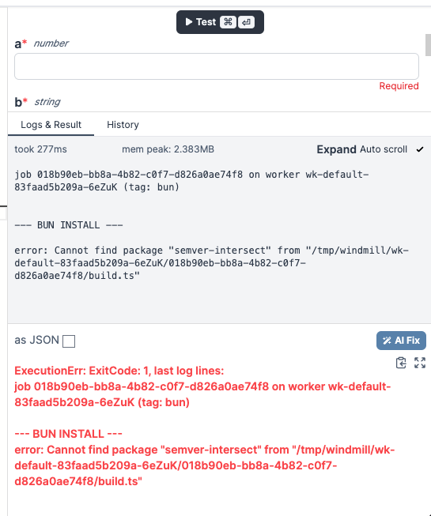

# bun-exec-issue

A minimal example of an issue found with Bun scripts in windmill, documented in [issue #2533](https://github.com/windmill-labs/windmill/issues/2533)

# Steps to reproduce

1. Clone this repo
2. Run `start.sh`
3. Login with default credentials `admin@windmill.dev`:`changeme`
4. Select `Skip setup`
5. Select `Manage windmill on the superadmins workspace`
6. Click create a `Script`
7. Select `Typescript (Bun)` as the execution type and dismiss the settings window
8. Run the script (no code changes are necessary)

You should see the following image in the console:

